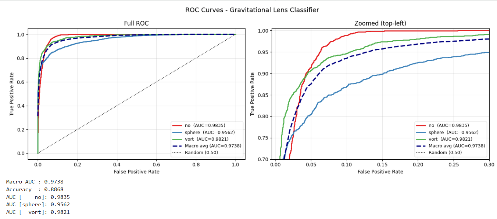

# Gravitational Lensing Image Classification

3-class classification of simulated gravitational lensing images (no lensing / spherical / vortex) using EfficientNet-B0 with transfer learning.

**Results:** Macro AUC 0.974, Accuracy 88.7% on 7,500 validation images.


## Dataset

- 30,000 training + 7,500 validation single-channel `.npy` images
- 3 balanced classes: `no` (no lensing), `sphere` (spherical lens), `vort` (vortex lens)
- Each image is a 1-channel 150×150 array with pixel values in [0, 1]

## Approach

**Model:** EfficientNet-B0 pretrained on ImageNet, adapted for single-channel input by averaging the first conv layer's RGB weights into one channel. Original classifier replaced with a custom head (Dropout → Linear → BatchNorm → ReLU → Dropout → Linear).

**Training strategy:**
- Phase 1 (epochs 1–3): backbone frozen, only head trains at lr=1e-3
- Phase 2 (epochs 4–75): full model fine-tuned with differential lr (backbone 1e-4, head 1e-3)
- OneCycleLR scheduler with 30% warmup + cosine decay
- Mixed precision (AMP), gradient clipping (max_norm=1.0), label smoothing (ε=0.05)

**Augmentation:** horizontal/vertical flips, 90° rotations, ±15° random rotation, ±0.05 brightness jitter. All physically motivated — lensing images have rotational symmetry and no preferred orientation.

## Results

| Metric | Value |
|--------|-------|
| Macro AUC | 0.9741 |
| Accuracy | 88.68% |
| AUC (no) | 0.9835 |
| AUC (sphere) | 0.9562 |
| AUC (vort) | 0.9821 |



**Per-class analysis:** The `sphere` class is the hardest to classify (AUC 0.956 vs 0.983 for `no`). The confusion matrix shows 343 sphere images misclassified as no-lensing and 194 as vortex — consistent with weak spherical lenses producing subtle distortions that resemble either an unlensed source or mild vortex shear.

## Repo structure

```
├── lens_classifier_colab.ipynb   # Full training + evaluation notebook
├── images/
│   ├── roc_curves.png
│   └── training_summary.png
└── README.md
```

## Running

Open `lens_classifier_colab.ipynb` in Google Colab with a GPU runtime. The notebook handles dataset extraction, training, and evaluation end-to-end.

## What I'd try next

- Class-weighted loss or focal loss to improve sphere classification
- Larger model (B2/B3) or upsampling to 224×224 to better match pretrained feature scales
- Ensemble of 3–5 models with different seeds
- Mixup/CutMix augmentation
